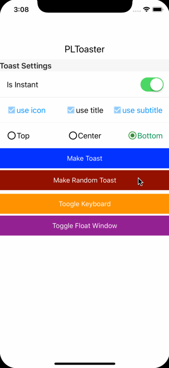
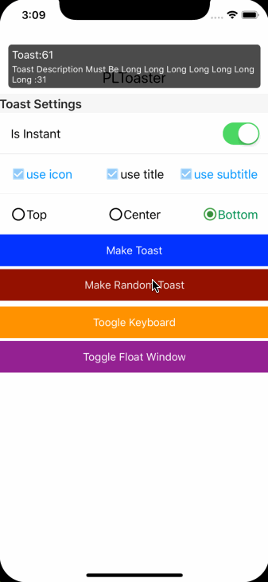

# PLToaster

[](https://travis-ci.org/zyonbao/PLToaster)
[](https://cocoapods.org/pods/PLToaster)
[](https://cocoapods.org/pods/PLToaster)
[](https://cocoapods.org/pods/PLToaster)

## GIF animation





## Example

To run the example project, clone the repo, and run `pod install` from the Example directory first.

## Requirements

## Installation

PLToaster is available through [CocoaPods](https://cocoapods.org). To install
it, simply add the following line to your Podfile:

```ruby
pod 'PLToaster'
```

## Author

zyonbao, zyonbao@icloud.com

## License

PLToaster is available under the MIT license. See the LICENSE file for more info.
